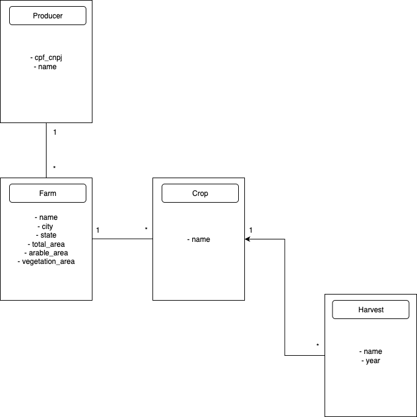

# Agronegócio API

API para gerenciamento de dados agrícolas, construída com Django e Django REST Framework.

## ✅ Pré-requisitos

- [Docker](https://www.docker.com/)
- [Docker Compose](https://docs.docker.com/compose/)

## 📌 Diagrama de Entidade-Relacionamento



## 🚀 Como rodar o projeto

1. Clone o repositório:

```bash
git clone <url-do-repo>
cd agronegocio
```

2. Copie o arquivo de variáveis de ambiente:

```bash
cp .env.example .env
```

3. Suba os containers e rode o projeto:

```bash
docker compose up --build
```

Este comando irá:

- Baixar a imagem do PostgreSQL e iniciar o banco de dados
- Construir a imagem da API Django
- Esperar o banco ficar disponível
- Rodar as migrações automaticamente
- Subir o servidor Django na porta `8000`

## 🌱 Popular banco de dados (Seed)

Para preencher o banco com dados iniciais, use o comando customizado:

```bash
docker compose run --rm api python manage.py seed
```

Esse comando executa o script `seed.py` que cria dados básicos para o sistema.

## 🌐 Acessos

- API Base: [http://localhost:8000/](http://localhost:8000/)
- Documentação Swagger: [http://localhost:8000/api/docs/](http://localhost:8000/api/docs/)

## 🧪 Rodar os testes

Execute os testes com o seguinte comando:

```bash
docker compose run --rm api python manage.py test
```

## 💡 Considerações

Este projeto foi desenvolvido como parte do processo seletivo da Brain Agriculture. Busquei aplicar boas práticas de código, arquitetura e testes, conforme descrito no desafio.

Estou aberto(a) a sugestões, feedbacks ou melhorias!

Obrigado pela oportunidade! 🌱
